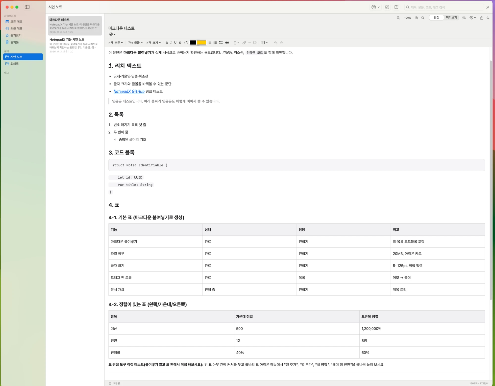
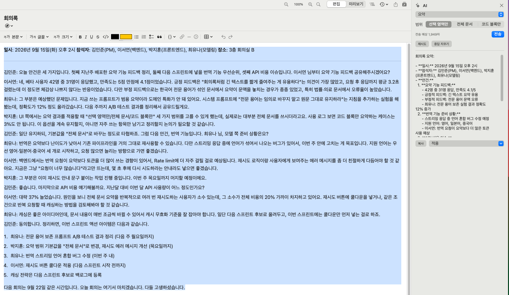

# NotepadX

macOS용 노트 앱. 리치 텍스트/코드 편집, 폴더·태그 정리, 분할 편집, OneDrive 동기화, 다양한 형식 내보내기, OpenAI 기반 AI 글쓰기 보조를 지원합니다.

편안하게 .md의 문법을 사용하면서 작성이 용이합니다.

### 다운로드

오른쪽 사이드바의 `Release` 를 통한 Download

## 주요 기능

1. **독립적인 첨부파일 관리**

   - 첨부파일을 업로드하여 원본과 무관한 독립적인 파일로 즉각적인 편집 및 확인이 가능합니다.
   - 사용방법 : 폴더로부터 바로 노트 내용으로 드래그(직관적 사용)
2. **AI 글 작성 보조 및 요약**

   - 환경변수를 통하여 `OPENAI_API_KEY`에 ChatGPT API Key를 등록하면 AI 요약을 통한 글 작성 관리가 가능합니다.

   
3. **코드 블록 및 상호작용**

   - 코드 블록 기능을 통하여 빠르게 코드를 피드백하면서 상호작용을 할 수 있습니다.
4. **폴더 및 즐겨찾기**

   - 폴더별 및 즐겨찾기 기능으로 빠르게 북마크할 수 있습니다.
5. **이미지 빠른 삽입**

   - 맥의 기본 캡처 기능을 활용해 NotepadX 본문 내 드래그로 손쉽게 이미지를 삽입할 수 있습니다.
6. **편집모드 / 미리보기 모드**

   - 작성 환경에 맞춘 편집모드 및 미리보기 모드를 제공합니다.
7. **태그 기반 문서 검색**

   - 태그를 통한 간편한 문서 검색 기능을 제공합니다.
8. **자동 본문 목차 정리 (TOC)**

   - 마크다운 문법을 사용하면 [미리보기] 버튼 옆의 목차 기능을 통해 본문 목차가 자동으로 정리됩니다.
9. **버전별 자동 저장**

   - 본문의 이전 작성 내용을 잊어버려도 버전별 자동 저장 기능을 통해 복구 및 확인이 용이합니다.
10. **다양한 포맷 내보내기**

    - 작성한 내용을 `내보내기` 기능을 통해 Markdown, HTML, PDF, DOCX 등 다양한 형식으로 공유할 수 있습니다.

---

#### 주의 사항

- 첨부 파일 업로드 시 앱 내부 경로로 복사되므로 원본 파일과는 독립적인 형태입니다.
- AI 요약 기능을 쓰기 위해서는 반드시 OpenAI 계정에 별도로 API KEY 사용 비용을 선결제해야 합니다.
