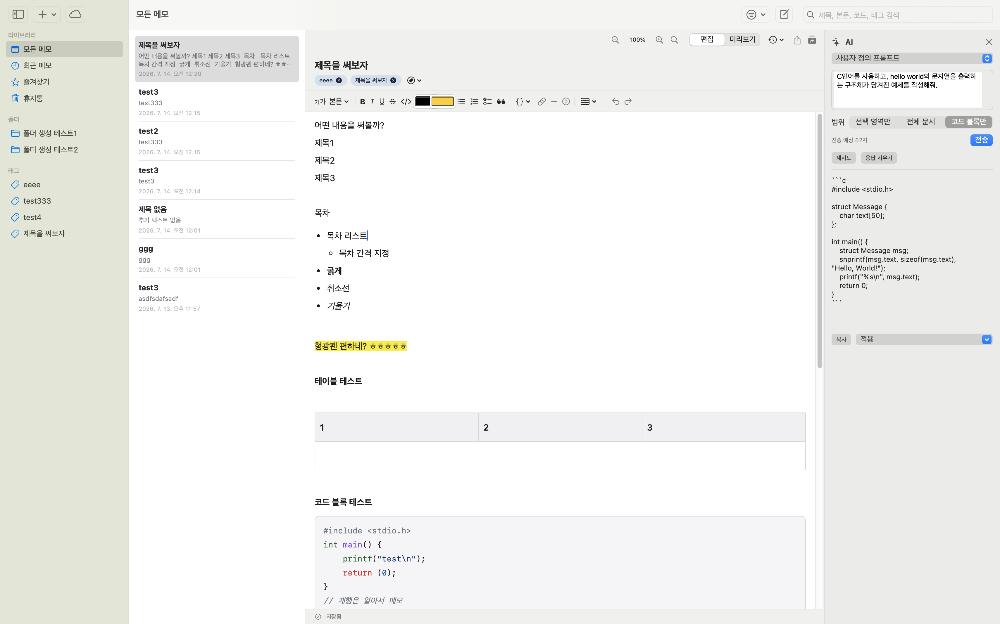
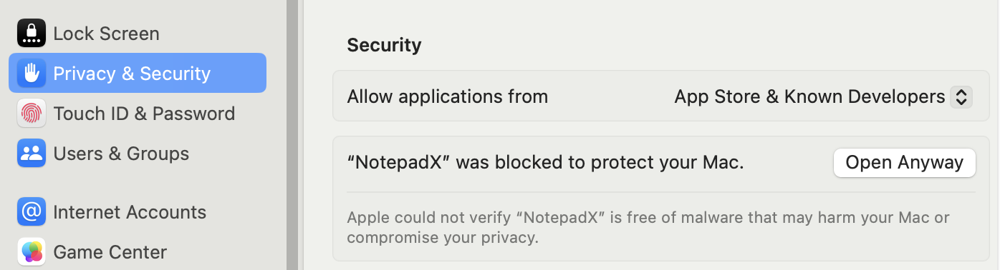
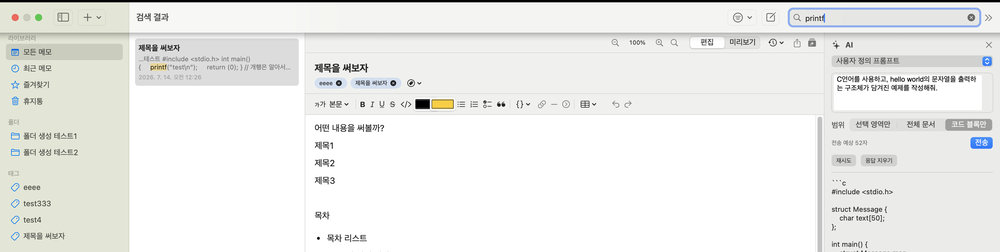
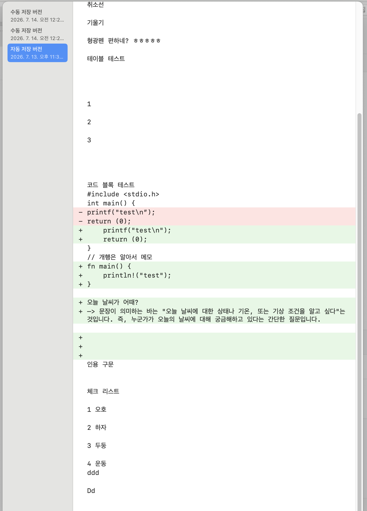
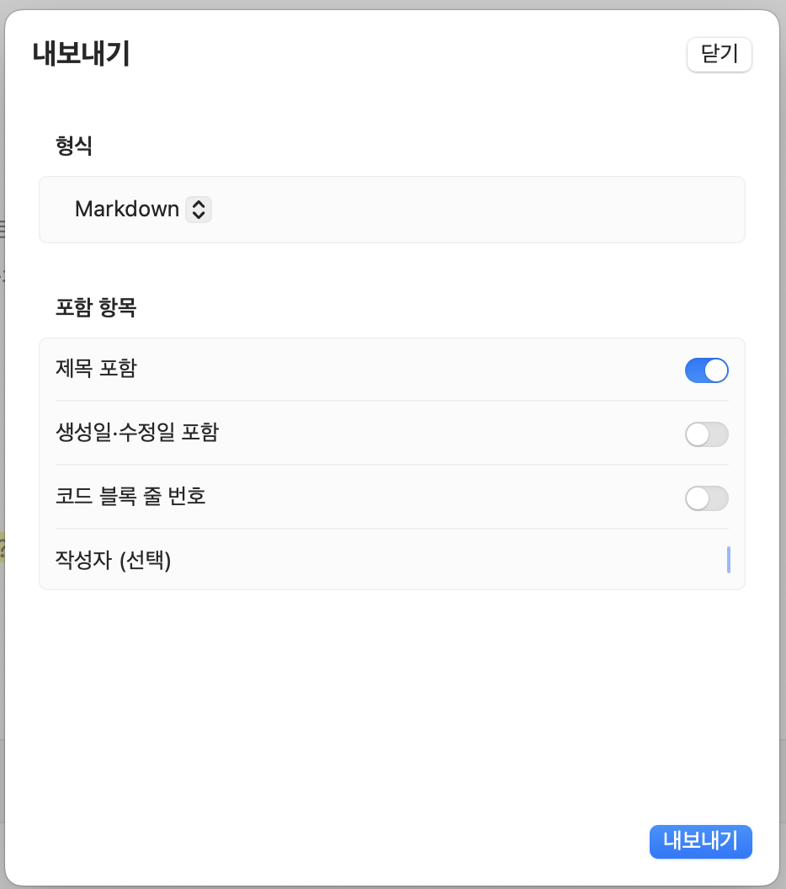
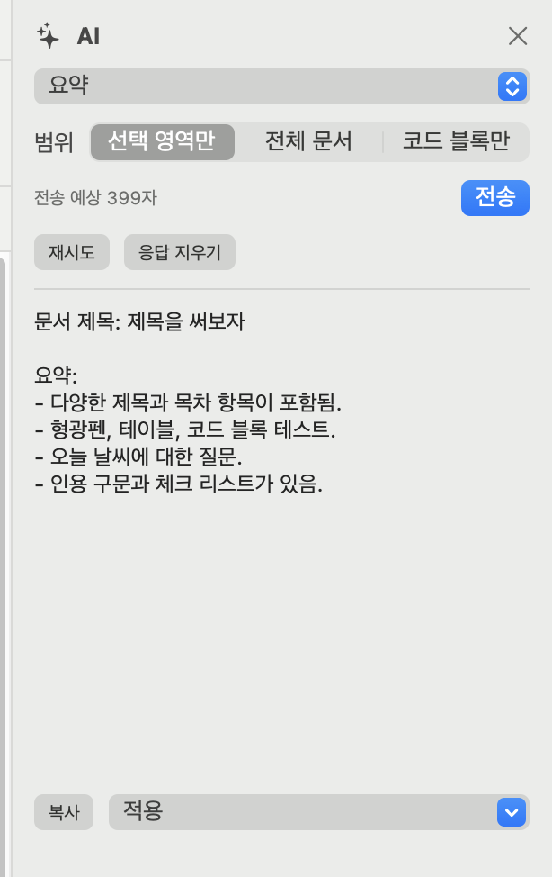
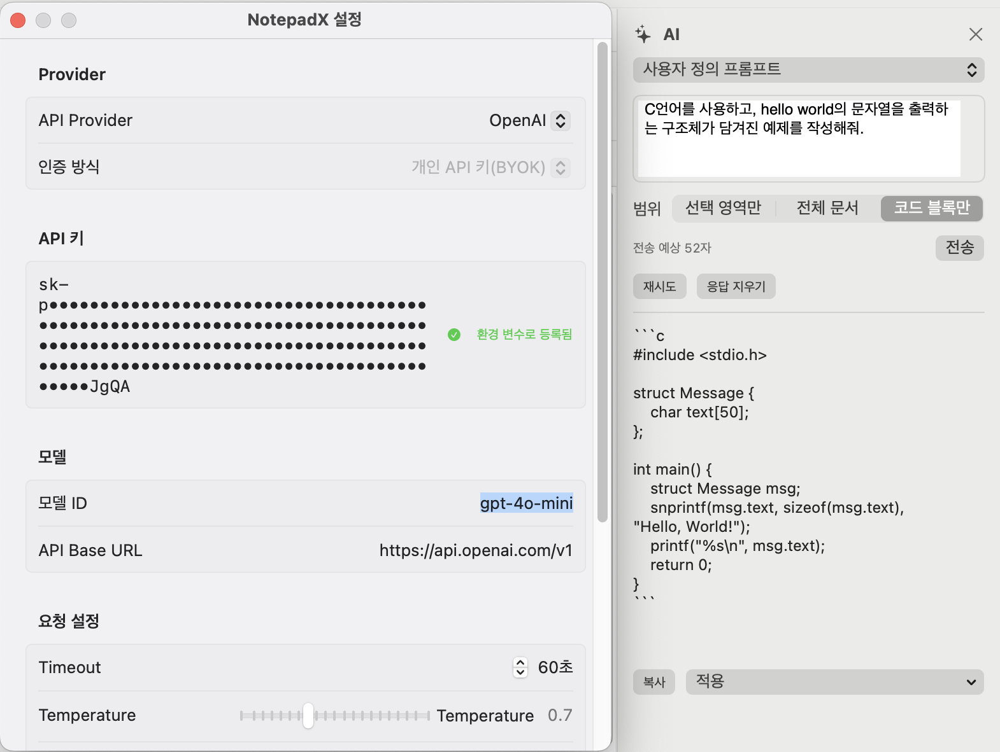

# NotepadX

macOS용 노트 앱. 리치 텍스트/코드 편집, 폴더·태그 정리, 분할 편집, OneDrive 동기화, 다양한 형식 내보내기, OpenAI 기반 AI 글쓰기 보조를 지원합니다.



## 기여하기

각 기능이 코드 어디에 있는지, 레이어(App/Features/Domain/Data) 사이 의존 방향이 어떻게 되는지, WebEditor(JS)를 고쳤을 때 무엇을 다시 빌드해야 하는지는 [CONTRIBUTING.md](CONTRIBUTING.md)에 정리되어 있습니다.

## 초기 개발 릴리즈버전

이 앱은 Apple 개발자 인증(공증, notarization)을 받지 않은 상태로 빌드·배포되기 때문에, 다운로드한 .app을 처음 실행하면 macOS Gatekeeper가 위와 같은 경고를 띄우며 실행을 막습니다. 악성코드가 아니라 서명/공증이 없어서 나타나는 정상적인 경고이며, 다음 방법으로 실행할 수 있습니다.

#### 방법 1 : 시스템 설정 → 개인정보 보호 및 보안으로 이동
하단의 "NotepadX가 차단되었습니다" 옆 "확인 없이 열기" 클릭
다시 앱을 실행하면 정상적으로 열립니다

#### 방법 2 : 터미널에서 격리 속성 제거
> bashxattr -cr /path/to/NotepadX.app

직접 빌드(xcodegen generate → Xcode 빌드)한 경우에는 본인 서명 팀으로 서명되므로 이 경고가 뜨지 않습니다.
## 주요 기능

### 리치 텍스트 편집
굵게·기울임·밑줄·취소선·글자색·형광펜·글자크기, 제목(1~6), 글머리표·번호·체크리스트, 인용문, 표, 이미지, 링크, 수평선, 접을 수 있는 세부 블록을 지원하는 툴바 기반 편집기입니다. `-->`/`<--`를 입력하면 바로 `→`/`←` 화살표 문자로 바뀝니다. 클립보드의 이미지를 붙여넣거나(⌘V) Finder에서 끌어다 놓을 수 있으며(10MB 이하), 별도 파일 저장 없이 메모 안에 바로 담겨서 내보내기·복사·복원 시 항상 이미지까지 함께 옮겨집니다. 화면에는 기본 최대 480px로 보여주고(원본 데이터는 그대로 유지), 이미지를 클릭해 오른쪽 아래 손잡이를 드래그하면 원하는 크기로 늘리거나 줄일 수 있습니다 — 조절한 크기도 저장됩니다. 1.5MB가 넘는 사진은 화면 해상도는 그대로 둔 채 자동으로 용량만 줄여서(JPEG 재인코딩) 저장하므로, 사진 한 장 붙여넣을 때마다 앱이 멈춰버리는 일이 없습니다.

`.md` 파일이나 GitHub·터미널 등에서 복사한 마크다운 원문을 그대로 붙여넣으면(⌘V), `#` 제목·`-`/`1.` 목록·`- [ ]` 체크리스트·인용문·표·펜스 코드블록·굵게/기울임·링크·구분선이 글자 그대로 남지 않고 실제 서식으로 바뀝니다. 이미 서식이 있는 것을 붙여넣을 때(예: 웹페이지 복사)는 이 변환을 타지 않고, 마크다운 문법 신호가 전혀 없는 평범한 문장도 그대로 텍스트로 남습니다.

툴바에서 글자 크기(5·10·15·20·50·60·100·125pt 프리셋, 그 사이 값은 직접 입력)와 글꼴(이 Mac에 실제로 설치된 글꼴 목록에서 선택, 목록에 있는 건 항상 정상 적용됩니다)도 지정할 수 있습니다.

### 파일 첨부
한글(HWP)·PDF·Word·Excel·PowerPoint·압축파일 등 이미지가 아닌 파일도 Finder에서 끌어다 놓거나(20MB 이하) 붙여넣을 수 있습니다. 이미지처럼 노트 안에 통째로 담기지 않고, 앱 전용 저장 폴더(`~/Library/Application Support/NotepadX/Attachments`, 첨부마다 별도 폴더에 원본 파일명 그대로) 안에 실제 파일로 저장되며, 노트에는 그 파일을 가리키는 카드만 남습니다. 카드는 파일 종류별로 다른 색·라벨(PDF·한글·DOC·XLS·PPT 등) 아이콘과 파일명·용량을 보여주고, 클릭하면 기본 앱으로 바로 열립니다.

### 코드 블록
18개 언어에 대한 구문 강조를 지원하는 코드 블록을 삽입할 수 있습니다.

### 폴더·태그 정리
계층형 폴더와 다중 태그로 메모를 분류하고, 즐겨찾기와 최근 메모 보기를 제공합니다. 삭제한 메모는 휴지통에 보관되며 30일 후 자동 삭제됩니다. 목록 상단의 체크상자 버튼을 누르면 메모 여러 개를 한 번에 선택해 휴지통으로 이동하거나(휴지통에서는 완전 삭제) 삭제할 수 있고, 완전 삭제 시 그 메모에만 붙어 있던 태그는 자동으로 함께 정리됩니다. 태그를 붙이거나 새로 만들면 왼쪽 사이드바에 바로 반영됩니다. 가운데 메모 목록에서 메모(체크상자로 여러 개를 고른 상태라면 고른 것 전부)를 왼쪽 사이드바의 폴더로 끌어다 놓으면 그 폴더로 바로 옮겨집니다.

### 전문 검색
제목·본문·코드·태그·폴더를 한 번에 검색할 수 있으며, 한글 부분 문자열 검색을 지원합니다. 검색 결과 목록에서 일치하는 단어가 하이라이트 표시되고, 본문 내 위치까지 미리 확인할 수 있습니다.



### 문서 개요
편집기 툴바의 목차 버튼을 누르면 왼쪽에 개요 패널이 열립니다. 문서 안의 제목(1~6)을 계층으로 보여주며, 제목을 누르면 그 위치로 바로 스크롤됩니다. 제목이 하나도 없으면 빈 상태 안내만 보여줍니다.

### 상태 표시줄 글자수·단어수
편집기 하단 상태 표시줄에 문서 전체 글자수·단어수가 항상 보이고, 텍스트를 선택하면 그 선택 영역만의 글자수·단어수로 바뀝니다.

### 버전 기록
자동 저장 버전과 수동 저장 버전을 모두 목록으로 확인할 수 있습니다. 이전 버전과 현재 버전을 줄 단위로 비교하는 diff 뷰(추가된 줄은 초록색, 삭제된 줄은 빨간색)를 제공하며, 원하는 시점으로 복원할 수 있습니다.



### 분할 편집
좌우/상하 분할 화면으로 같은 문서 또는 다른 문서를 동시에 편집할 수 있습니다. 같은 문서를 여러 패널에서 동시에 열어도 저장 충돌이 발생하지 않도록 처리하며, 패널별로 편집/미리보기 모드를 독립적으로 전환할 수 있습니다.

### OneDrive 동기화
동기화 폴더를 한 번 지정하면 이후로는 메모를 저장할 때마다 자동으로 동기화됩니다("지금 동기화"를 매번 누를 필요 없음). Microsoft Graph OAuth로 연동하며, 로컬과 원격 양쪽에 변경이 생긴 경우 3-way 충돌 감지를 통해 자동 덮어쓰기 없이 로컬 유지·원격 유지·둘 다 보존 중 선택할 수 있습니다.

### 내보내기
Plain Text, Markdown, HTML, RTF, RTFD, PDF, DOCX(Word 서식·자동 번호 매기기 포함), 앱 전용 JSON 형식으로 내보낼 수 있습니다. 내보내기 시 제목 포함 여부, 생성일·수정일 포함 여부, 코드 블록 줄 번호 표시 여부, 작성자 정보를 개별적으로 선택할 수 있습니다.



### AI 글쓰기 보조
OpenAI API와 연동하여 요약, 문장 다듬기, 맞춤법 교정, 번역, 제목/목차 생성, 코드 설명·리팩터링 등 21종의 작업을 지원하며, 직접 프롬프트를 입력하는 사용자 정의 모드도 제공합니다. 응답은 스트리밍으로 표시됩니다.

- **적용 범위 선택**: 선택 영역만 / 전체 문서 / 코드 블록만 중에서 AI에 전달할 범위를 지정할 수 있습니다.
- **전송 예상 글자 수**: 요청을 보내기 전에 실제로 전송될 글자 수를 미리 확인할 수 있습니다.
- **재시도 · 응답 지우기**: 마음에 들지 않는 응답은 같은 조건으로 재시도하거나 즉시 지울 수 있습니다.
- **복사 · 적용**: 생성된 결과를 클립보드에 복사하거나, 문서에 바로 적용(치환/삽입)할 수 있습니다.
- **연결 테스트**: 설정한 API 키·엔드포인트가 정상적으로 동작하는지 미리 확인할 수 있습니다.





## 요구 사항

- macOS 14 이상
- Xcode 15 이상
- [XcodeGen](https://github.com/yonaskolb/XcodeGen) (`brew install xcodegen`)

## 빌드 및 실행

```bash
xcodegen generate
open NotepadX.xcodeproj
```

Xcode에서 `NotepadX` 스킴을 선택하고 Cmd-R로 실행합니다. 최초 실행 시 Signing & Capabilities에서 서명 팀을 본인 Apple ID로 지정해야 합니다.

커맨드라인으로 빌드/테스트만 하려면:

```bash
swift build
swift test
```

## AI 기능 사용 설정

설정 > AI 탭의 API 키 항목에 키를 입력하고 **"키 등록"** 버튼을 누르면 macOS Keychain에 저장됩니다. 한 번 등록하면 앱을 다시 실행하거나 로그아웃/재부팅해도 초기화되지 않으며, "키 삭제" 버튼을 누르기 전까지는 그대로 유지됩니다. 값을 바꾸고 싶으면 먼저 "키 삭제"로 지운 뒤 새 키를 등록하세요.

### (레거시) 환경 변수 폴백

Keychain에 등록된 키가 없을 때만 `OPENAI_API_KEY` 환경 변수를 대신 읽습니다. CI나 커맨드라인 빌드처럼 앱 UI 없이 키를 넣어야 하는 경우에 쓸 수 있습니다.

```bash
export OPENAI_API_KEY="sk-..."
```

Finder/Dock에서 더블클릭으로 실행하는 `.app`은 `~/.zshrc` 같은 셸 설정을 읽지 않습니다. GUI로 실행하는 앱에도 적용하려면 `launchctl setenv OPENAI_API_KEY "sk-..."`를 쓸 수 있지만, 이 방식은 로그아웃/재부팅하면 초기화되고 매번 다시 등록해야 합니다 — 그래서 위의 "키 등록" 버튼(Keychain) 쪽을 권장합니다.

```bash
# 1) 실제 키로 교체
open -e ~/Library/LaunchAgents/com.notepadx.env.openai-api-key.plist
# "여기에_실제_키_붙여넣기" 부분을 sk-proj-... 로 바꾸고 저장

# 2) 지금 바로 적용 (재부팅 안 해도 즉시 반영)
launchctl load ~/Library/LaunchAgents/com.notepadx.env.openai-api-key.plist

# 3) NotepadX 재시작
killall NotepadX 2>/dev/null
open build/NotepadX.app
```

이 plist 파일도 평문 텍스트라 `~/.zshrc`에 적는 것과 보안 수준은 동일합니다(계정 소유자만 읽을 수 있는 홈 디렉터리 안이라는 점에서). 더 안전하게 Keychain으로 관리하고 싶다면 앱 안에 API 키 저장 기능을 다시 넣어야 합니다(현재는 의도적으로 제거된 상태).

## 데이터 저장 위치

- 데이터베이스: `~/Library/Application Support/NotepadX/NotepadX.sqlite`
- 첨부파일: `~/Library/Application Support/NotepadX/Attachments/`